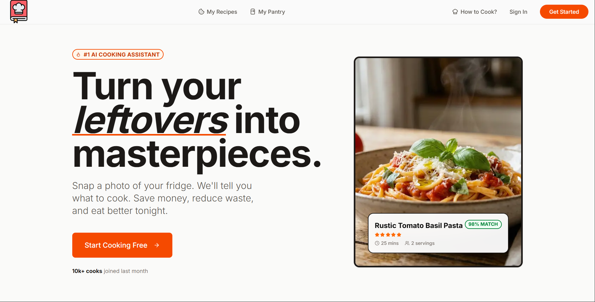
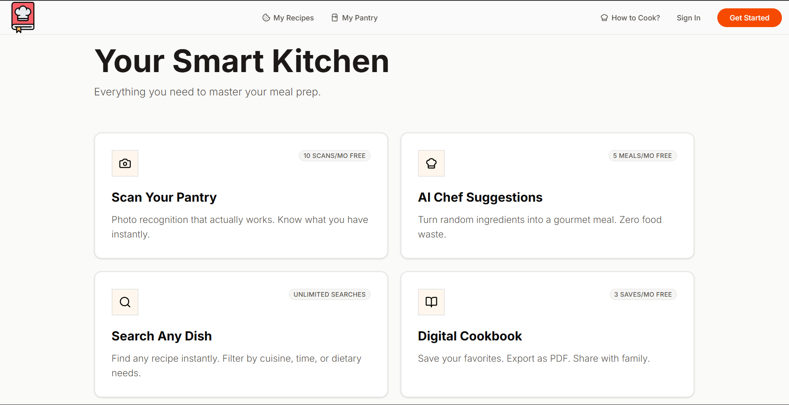
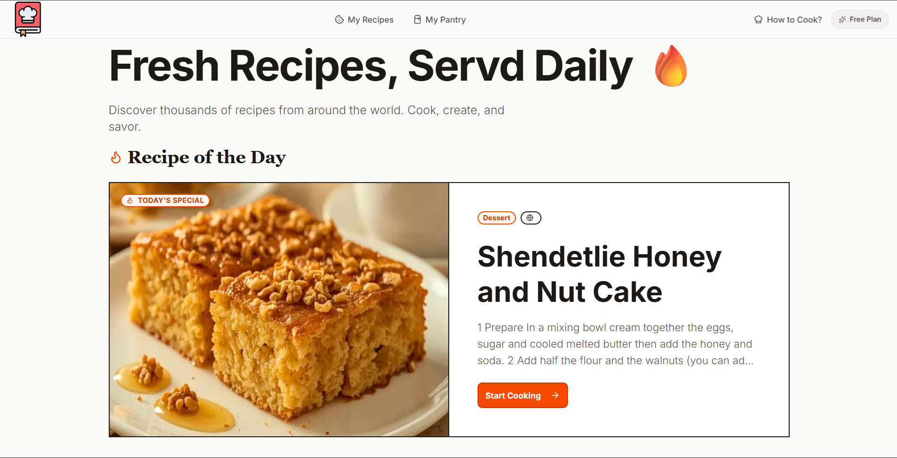
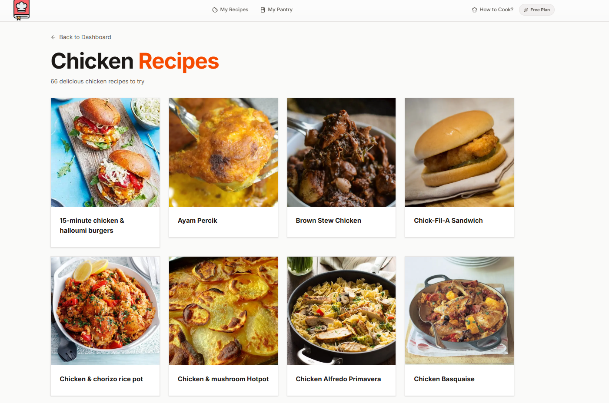
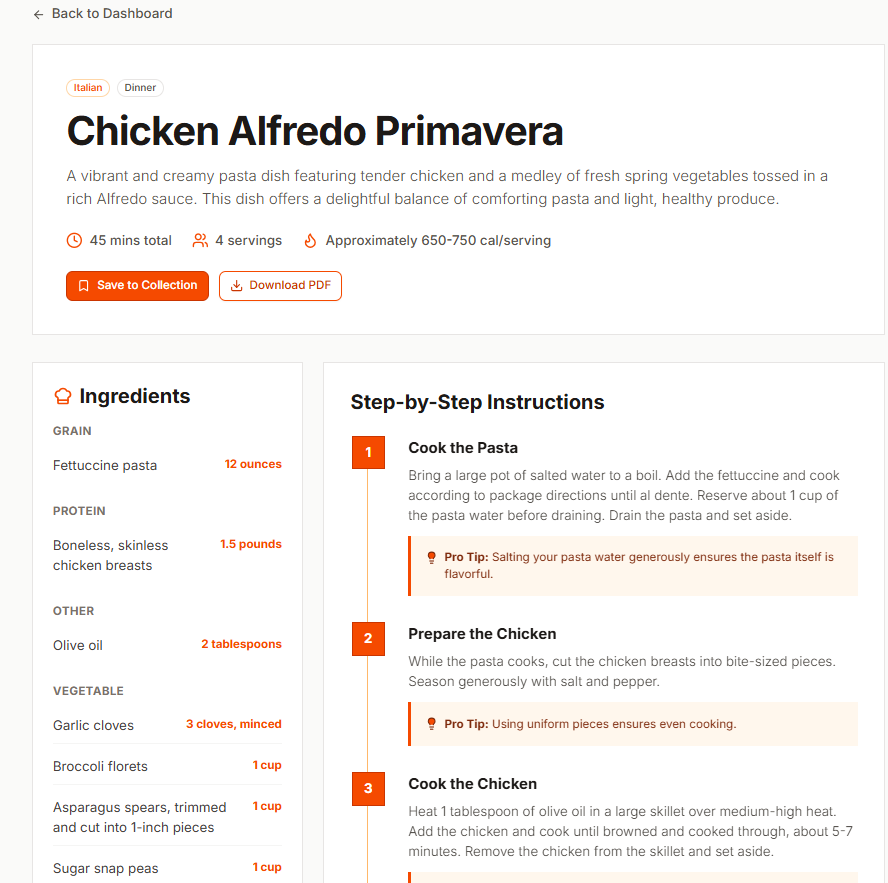
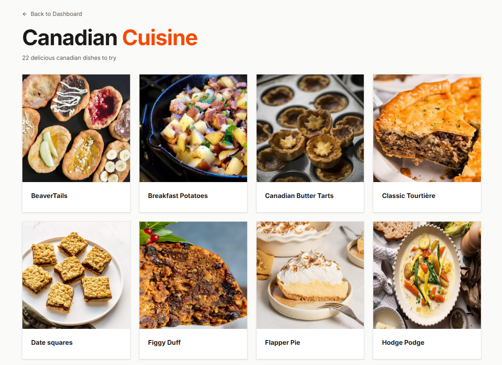
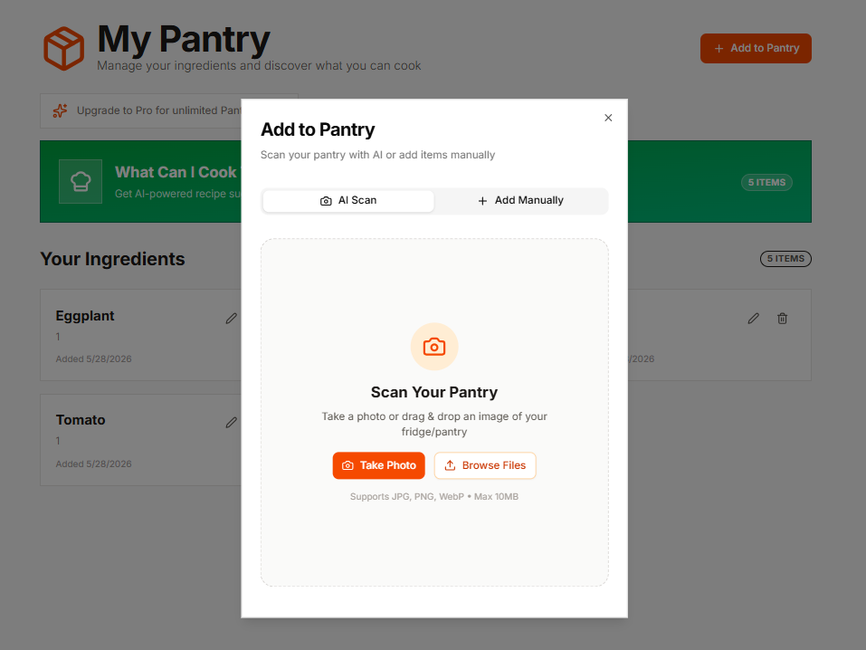
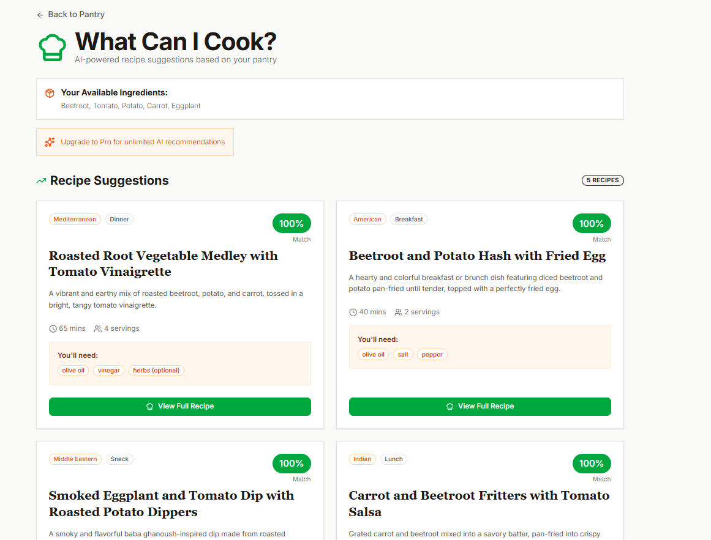

# 🍳 ChefMate-AI

[](https://reactjs.org/) 
[](https://nextjs.org/) 
[](https://tailwindcss.com/) 
[](https://strapi.io/) 
[](https://www.postgresql.org/) 
[](https://openai.com/) 
[](LICENSE)

> **Turn your leftovers into masterpieces.** Snap a photo of your fridge. We'll tell you what to cook. Save money, reduce waste, and eat better tonight.

<p align="center">
  
</p>

---

## 🌟 Overview

**ChefMate AI** is a full-stack AI-powered recipe platform that allows users to:

- 🥫 **Manage your pantry** – Add, remove, and track ingredients
- 🔍 **Explore recipes** – Browse by category, cuisine, or popularity
- 🤖 **Get AI-based recipe suggestions** – Based on what's in your fridge

This project demonstrates **full-stack development, SaaS architecture, AI integration, and modern UI/UX skills**.

---

## 🚀 Key Features

| Feature | Description |
|---------|-------------|
| 🤖 **AI-Powered Recipe Suggestions** | Get recipes based on pantry items |
| 🥫 **Pantry Management** | Add, remove, and track ingredients |
| 📸 **AI Pantry Scanner** | Scan items for instant recipe ideas |
| 📚 **Explore Recipes Page** | Browse by category, cuisine, or popularity |
| 🔐 **User Authentication** | Google OAuth login for secure access |
| 💰 **SaaS Features** | Subscription plans, pricing, user management |
| 🛡️ **Bot Protection & Rate Limiting** | Powered by Arcjet |
| 📱 **Responsive UI** | Tailwind CSS + Shadcn UI |
| ⚡ **Server Actions** | Backend logic for pantry, recipes, and more |

---

## 📸 Screenshots

### 🏠 Hero Section


### ⚡ Features Grid


### 📚 Recipe of the Day


### 🍗 Chicken Recipes


### 📄 Recipe Detail Page


### 🥘 Cuisine Page


### 🥫 Pantry Management


### 🤖 AI Recipe Suggestions


## 🛠️ Tech Stack

| Category | Technology |
|----------|------------|
| **Frontend** | Next.js 15, React 19, Tailwind CSS, Shadcn UI |
| **Backend** | Strapi Headless CMS |
| **Database** | PostgreSQL |
| **Auth** | Google OAuth (via Strapi/NextAuth) |
| **AI** | OpenAI API / Gemini API |
| **Security** | Arcjet (Rate Limiting, Bot Protection) |
| **Payments** | Stripe |
| **Deployment** | Vercel |

---

## 📊 Database Schema (Strapi)

### Recipe Collection
```json
{
  "title": "Spaghetti Carbonara",
  "description": "Classic Italian pasta dish",
  "ingredients": ["Pasta", "Eggs", "Pecorino", "Pancetta"],
  "instructions": "...",
  "prepTime": 15,
  "cookTime": 15,
  "difficulty": "Medium",
  "cuisine": "Italian",
  "category": "Dinner",
  "image": { "url": "..." }
}
